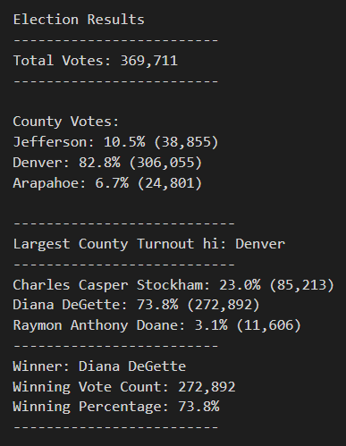

# Election Analysis

## Overview of Election Audit

The purpose of this election audit analysis is to certify the tabulated election results from the U.S. congressional precinct in Colorado. The election audit will be used to determine the number of votes cast, a list of all the candidates who received votes, the total number of votes each candidate received, the percentage of votes each candidate won, and the winner of the election based on the popular vote. It will also summarize the voter turnout for each county, the percentage from each county out of the total count, and the county with the highest turnout. The analysis was created with Python with the script here: [PyPoll_Challenge.py](https://github.com/nguyencao247/Election_Analysis/blob/main/PyPoll_Challenge.py), with the full results written here: [election_analysis.txt](https://github.com/nguyencao247/Election_Analysis/blob/main/analysis/election_analysis.txt). 

## Election-Audit Results

### Election Results table from election_analysis.txt:
<p align="center"></p>

- How many votes were cast in this congressional election?
    - There were 369,711 total votes cast in this congressional election. 
- Provide a breakdown of the number of votes and the percentage of total votes for each county in the precinct.
    - There were three counties that voted: Jefferson, Denver, and Arapahoe.
    - Jefferson county received 10.5% of the vote and 38,855 number of votes.
    - Denver county received 82.8% of the vote and 306,055 number of votes.
    - Arapahoe county received 6.7% of the vote and 24,801 number of votes.
- Which county had the largest number of votes?
    - Denver county received the largest number of votes with 82.8% of the votes and 306,055 number of votes.
- Provide a breakdown of the number of votes and the percentage of the total votes each candidate received.
    - There were three candidates that received votes: Charles Casper Stockham, Diana DeGette, and Raymon Anthony Doane.
    - Charles Casper Stockham received 23.0% of the vote and 85,213 number of votes.
    - Diana DeGette received 73.8% of the vote and 272,892 number of votes.
    - Raymon Anthony Doane received 3.1% of the vote and 11,606 number of votes.
- Which candidate won the election, what was their vote count, and what was their percentage of the total votes?
    - Diana DeGette won the vote with 73.8% of the vote and 272,892 number of votes.

## Election-Audit Summary

### Business Proposal

By using Python to analyze the congressional election results instead of Excel, Seth has automated this process. The script contains no magic numbers, only variables (as well as lists and dictionaries) that can be easily modified to fit the specific needs of future elections. A sample of the election analysis script where the variables were created can be shown below.

```
# Initialize a total vote counter.
total_votes = 0

# Candidate Options and candidate votes.
candidate_options = []
candidate_votes = {}

# 1: Create a county list and county votes dictionary.
county_options = []
county_votes = {}

# Track the winning candidate, vote count and percentage
winning_candidate = ""
winning_count = 0
winning_percentage = 0

# 2: Track the largest county and county voter turnout.
win_county_name = ""
win_county_count = 0
win_county_percent = 0
```

The variables are mutable; therefore, users can change them to fit their specific goal. Users can also create as many lists and dictionaries as they need to analyze the data in more detail. Where it says "county_options = []" and
"county_votes = {}", these variables can be edited there. 


### Modification Examples

Two examples of how this script can be modified and used for other elections can include: voter demographics and methods of voting.
1. For any election, it is important to know who your constituents are. With election data, voter demographics like age, gender, ethnicity, etc. can be used to learn more about your voters. Candidates can see which group they are most or least popular with and use that data to plan their future campaigns. 
2. This election analysis script can be modified to analyze the three different voting methods: mail-in, punch cards, and direct recording electronic (DRE). Different types of voting can leave room for error or cause inefficiency. If the election results can show which method is used the least, we could potentially remove options that are not so popular anymore. 
